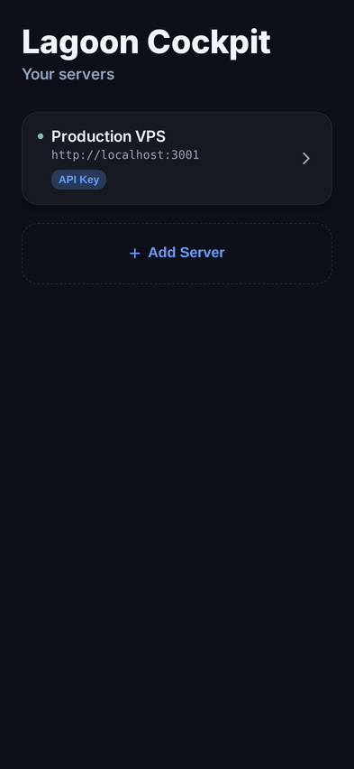

<div align="center">


# Lagoon Cockpit

**The only self-hosted, mobile-first Docker management app.**

Monitor, manage, and automate your infrastructure from your phone — no SSH required.

[](https://www.gnu.org/licenses/agpl-3.0)
[](https://github.com/Lagoon-Tech-Systems/lagoon-cockpit/stargazers)
[](https://github.com/Lagoon-Tech-Systems/lagoon-cockpit/issues)
[](https://github.com/Lagoon-Tech-Systems/lagoon-cockpit/commits/main)
[](https://github.com/orgs/lagoon-tech-systems/packages/container/cockpit)
[](https://www.npmjs.com/package/lagoon-cockpit-cli)
[](https://expo.dev/)

</div>

---

## The Problem

Portainer and Rancher are powerful, but they're desktop web UIs. When your server goes down at 2 AM, you're reaching for your phone, not your laptop.

**Lagoon Cockpit** gives you a native mobile app + CLI + lightweight API agent. No Kubernetes required. Just Docker.

---

## Demo

<div align="center">

</div>

---

## Screenshots

<div align="center">

| Overview Dashboard | Containers | Compose Stacks | Manage Hub |
|:--:|:--:|:--:|:--:|
|  |  |  |  |
| Real-time gauges, uptime, system resources | Search, filter, bulk actions with inline controls | Compose projects with stack-level health | 14+ screens: System Map, Disk, Webhooks, Alerts |

</div>

---

## How It Compares

| Feature | Lagoon Cockpit | Portainer | Rancher |
|---------|:-:|:-:|:-:|
| Native mobile app (iOS/Android) | ✅ | ❌ | ❌ |
| CLI companion | ✅ 25+ commands | ❌ | ✅ |
| Multi-server from one app | ✅ | ✅ (paid) | ✅ |
| Windows Server support | ✅ | ❌ | ❌ |
| Biometric lock (Face ID / fingerprint) | ✅ | ❌ | ❌ |
| Push notifications | ✅ | ❌ | ❌ |
| Custom alert rules | ✅ | ❌ | ✅ |
| Webhook integrations (Slack/Discord/n8n) | ✅ | ✅ | ✅ |
| Scheduled container actions (cron) | ✅ | ❌ | ❌ |
| Remote exec from phone | ✅ (whitelisted) | ✅ | ✅ |
| Regex log search | ✅ | ✅ | ✅ |
| Visual system map | ✅ | ❌ | ❌ |
| Maintenance mode | ✅ | ❌ | ❌ |
| Prometheus metrics export | ✅ 37+ metrics | ✅ | ✅ |
| Data integrations (Grafana, Prometheus) | ✅ | ❌ | ✅ |
| Memory footprint | ~22 MB | ~250 MB | ~1 GB+ |
| Kubernetes required | ❌ | ❌ | ✅ |
| Self-hosted | ✅ | ✅ | ✅ |

---

## Quick Start

```bash
# One command to deploy
docker run -d \
  --name cockpit \
  -e API_KEY=your-secret-key \
  -e JWT_SECRET=$(openssl rand -hex 32) \
  -v /var/run/docker.sock:/var/run/docker.sock \
  -v /proc:/host/proc:ro \
  -p 3000:3000 \
  ghcr.io/lagoon-tech-systems/cockpit:latest
```

Then connect from the mobile app or CLI:

```bash
npx lagoon-cockpit-cli connect http://your-server:3000 your-secret-key
npx lagoon-cockpit-cli overview
```

---

## Features

### Core (Community Edition — Free & Open Source)

| Feature | Description |
|---------|-------------|
| **Dashboard** | CPU, RAM, disk gauges with auto-refresh and problem detection |
| **Container Management** | Start, stop, restart, bulk ops, logs, exec |
| **Compose Stacks** | Manage Docker Compose stacks as groups |
| **Windows Support** | Services, processes, Event Log on Windows Server |
| **Multi-Server** | Connect up to 3 servers from one app |
| **Alert Rules** | Threshold-based alerts (CPU > 90% for 5 min) |
| **Webhooks** | Fire events to Slack, Discord, n8n |
| **Scheduled Actions** | Cron-based container automation |
| **Real-Time** | Server-Sent Events for live updates |
| **Metrics History** | 7-day CPU/RAM/disk trends with sparklines |
| **System Map** | Visual node-graph of infrastructure |
| **Network Topology** | Container networks with IPs |
| **Disk Management** | Breakdown by category, system prune |
| **SSL Monitoring** | Certificate expiry countdown |
| **Endpoint Probing** | HTTP health checks with response times |
| **Biometric Lock** | Face ID / fingerprint with auto-lock |
| **CLI Tool** | 25+ terminal commands |
| **Prometheus Export** | 37+ metrics at `/metrics` |
| **Data Integrations** | Connect Prometheus, Grafana, or any JSON API |

### Pro & Enterprise

| Feature | Pro | Enterprise |
|---------|-----|-----------|
| Push Notifications | Yes | Yes |
| Incident Management | Yes | War Room + Postmortem |
| Automated Remediation | 10 rules | Unlimited + Runbooks |
| Status Pages | 3 | Unlimited + Custom Domain |
| Uptime Monitoring | 25 endpoints | Unlimited |
| SLA Tracking | Basic | Full PDF Export |
| ChatOps | Telegram + Slack | + WhatsApp |
| Multi-Server | 20 servers | Unlimited |
| RBAC | 5 users | Unlimited + Custom Roles |
| Audit Trail | 30 days | Unlimited + Export |
| Data Integrations | 10 | Unlimited + Datadog, CloudWatch, PagerDuty |
| SSO/SAML | - | Yes |
| White-Label | - | Yes |

---

## Architecture

```
Mobile App (iOS/Android)          CLI Tool
         \                        /
          \                      /
           +----- REST API -----+
                    |
            Cockpit API Agent        Windows Agent
           (Node.js + SQLite)       (Python + Flask)
                    |                     |
            Docker Engine            Windows Services
```

- **Mobile App**: Expo 55 / React Native / React 19
- **API**: Express + SQLite + Docker Engine API (22 MB container)
- **CLI**: Zero-dep Node.js, installable via `npx`
- **Windows Agent**: Python Flask + psutil + pywin32

---

## Security

Built for production environments. Security at every layer:

- **JWT auth** with token rotation and fingerprint binding
- **Rate limiting** with sliding window (global + per-endpoint)
- **JSON Schema validation** on all inputs
- **Helmet** security headers (CSP, HSTS, X-Frame-Options)
- **Strict CORS** with origin allowlist
- **Enhanced audit logging** (IP, user-agent, request fingerprint)
- **Non-root Docker container** with resource limits
- **Offline license validation** (no phone-home)
- **Secret scanning** in CI (TruffleHog)

See [SECURITY.md](SECURITY.md) for the full security architecture.

---

## Self-Hosting

### Docker Compose (Recommended)

```yaml
services:
  cockpit:
    image: ghcr.io/lagoon-tech-systems/cockpit:latest
    restart: unless-stopped
    env_file: .env
    volumes:
      - /var/run/docker.sock:/var/run/docker.sock
      - /proc:/host/proc:ro
      - cockpit_data:/app/data
    deploy:
      resources:
        limits:
          cpus: "0.25"
          memory: 256M

volumes:
  cockpit_data:
```

### Environment Variables

```bash
# Required
API_KEY=your-secret-key
JWT_SECRET=random-64-char-string

# Optional
AUTH_MODE=key              # "key" or "users" (multi-user RBAC)
SERVER_NAME=Production VPS
LICENSE_KEY=               # Pro/Enterprise license (CE if empty)
FORCE_HTTPS=false
CORS_ORIGINS=              # Comma-separated allowed origins
```

See [.env.example](packages/api/.env.example) for all options.

### Zero-Downtime Deploy & Rollback

```bash
# Deploy with automatic rollback on failure
./scripts/deploy.sh

# Manual rollback to previous version
./scripts/deploy.sh --rollback
```

The deploy script saves the current image before upgrading, waits for the deep health check (`/health` verifies API + DB + Docker), and auto-rolls back if the new container fails.

---

## Data Integrations

Cockpit natively pulls data from external monitoring sources:

| Adapter | Edition | Protocol |
|---------|---------|----------|
| Prometheus | CE | HTTP (PromQL queries + alerts) |
| Grafana | CE | HTTP API (alerts + annotations) |
| Generic HTTP/JSON | CE | Any REST API with field mappings |
| Datadog | Pro | Datadog API |
| CloudWatch | Pro | AWS API |
| PagerDuty | Pro | PagerDuty API |
| Custom Webhook | Pro | Inbound HTTP push |

```bash
# Add a Prometheus integration via CLI
curl -X POST http://localhost:3000/api/integrations \
  -H "Authorization: Bearer $TOKEN" \
  -d '{"adapter":"prometheus","name":"My Prom","config":{"url":"http://prometheus:9090"}}'
```

---

## Prometheus & Grafana

Cockpit exports 37+ metrics at `/metrics` for Prometheus scraping:

```yaml
- job_name: 'cockpit'
  scrape_interval: 30s
  static_configs:
    - targets: ['cockpit:3000']
  metrics_path: '/metrics'
  authorization:
    type: Bearer
    credentials: your-metrics-token
```

---

## Resource Footprint

| Metric | Value |
|--------|-------|
| Memory usage | ~22 MB / 256 MB limit |
| CPU usage | ~0% at idle |
| Image size | ~120 MB (node:20-alpine) |
| Dependencies | 5 npm packages |
| Startup time | < 2 seconds |

---

## Contributing

We welcome contributions. Please read our [Security Policy](SECURITY.md) before reporting vulnerabilities.

```bash
# Development setup
git clone https://github.com/Lagoon-Tech-Systems/lagoon-cockpit.git
cd lagoon-cockpit
npm install
cd packages/api && npm run dev    # API with hot reload
cd packages/app && npm start      # Expo dev server
```

---

## License

Community Edition: [AGPL-3.0](LICENSE)
CLI Tool: [MIT](packages/cli/LICENSE)
Pro/Enterprise: Commercial License

---

<div align="center">

**Built with ❤️ in Abidjan, Côte d'Ivoire by [Lagoon Tech Systems](https://lagoontechsystems.com)**

[⭐ Star this repo](https://github.com/Lagoon-Tech-Systems/lagoon-cockpit) · [🐛 Report a Bug](https://github.com/Lagoon-Tech-Systems/lagoon-cockpit/issues) · [💡 Request a Feature](https://github.com/Lagoon-Tech-Systems/lagoon-cockpit/issues)

</div>
